# Web frontend

React chat UI and human-agent console. After sign-in, the customer chat runs against the
real, live turn endpoint (`LiveChatClient`); a scripted fixture conversation (`FixtureChatClient`)
remains for component tests only, never the running app.

## Stack

| Tool                                                                                | What it is used for                                                        |
| ----------------------------------------------------------------------------------- | -------------------------------------------------------------------------- |
| [Vite](https://vite.dev)                                                            | Dev server and production build                                            |
| React 19 + TypeScript (strict, `noUncheckedIndexedAccess`)                          | The UI                                                                     |
| [Vitest](https://vitest.dev) + [Testing Library](https://testing-library.com)       | Unit and component tests, with a coverage gate                             |
| [jest-axe](https://github.com/nickcolley/jest-axe)                                  | Automated accessibility checks (WCAG 2.2 AA target) in the component tests |
| ESLint (`typescript-eslint`, `react-hooks`, `react-refresh`, `jsx-a11y`) + Prettier | Lint and format                                                            |

[Zod](https://zod.dev) validates every turn against the same shape as `contracts/service_v1/api.py`'s
`TurnRequest`/`TurnResponse`. Colors, type, spacing and the other visual values are design tokens
in `src/styles/tokens.css`, and the shared components are in `src/components/ui/`.

**Known gaps:**

- ESLint is pinned to `^9` rather than the current `^10`, because `eslint-plugin-jsx-a11y@6.10.2`
  does not yet declare `10` in its peer range. Move both together once a jsx-a11y release
  supports it.
- The `web` CI job has no dependency-vulnerability scan yet; adding one would cover the runtime
  dependencies (`react`, `react-dom`, `zod` and the Radix tabs primitive).

## Customer chat

`src/features/customer-chat/` is a self-contained feature:
`contracts.ts` (the Zod schemas), `client.ts` (the `ChatClient` seam and its two implementations —
`LiveChatClient`, the real HTTP client against `POST /v1/turns` behind a demo session, which the
running app uses; `FixtureChatClient`, which replays `fixtures.ts`'s scripted English conversation
for component tests only), `useConversation.ts` (the turn-by-turn state) and `components/` (the
reference-date banner, the message list with a polite live region, numbered choice buttons, the
confirmation button, the text form).

## Commands

```bash
npm install        # installs from package-lock.json
npm run dev         # dev server
npm run build       # tsc -b && vite build
npm run lint        # eslint .
npm run format       # prettier --check .
npm run format:fix   # prettier --write .
npm run test         # vitest run --coverage
```

Node 22 (`.nvmrc`), matching the version CI installs.

## Screens

The captures come from the deployed system with simulated data. Each sign-in page is shown in
its own language.

| Español                                                                         | Português                                                                          | English                                                                         |
| ------------------------------------------------------------------------------- | ---------------------------------------------------------------------------------- | ------------------------------------------------------------------------------- |
| 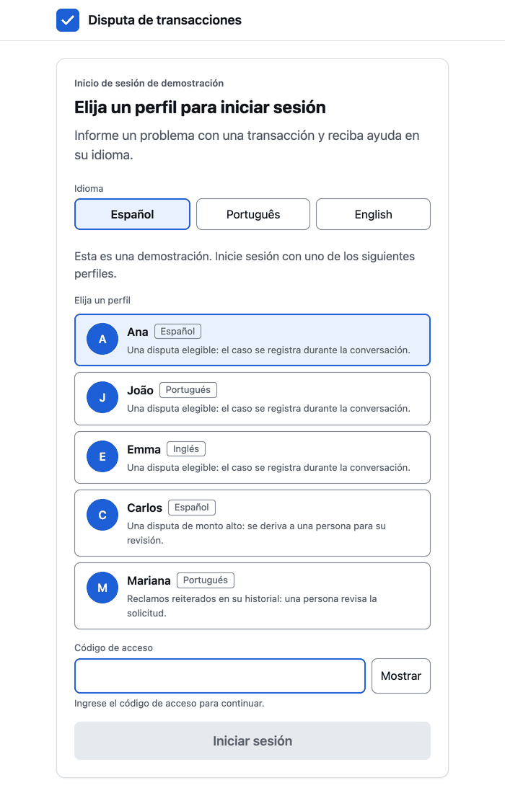    | 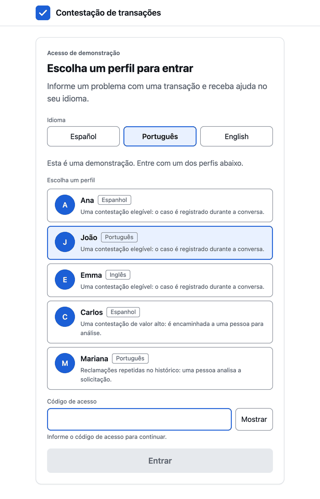    | 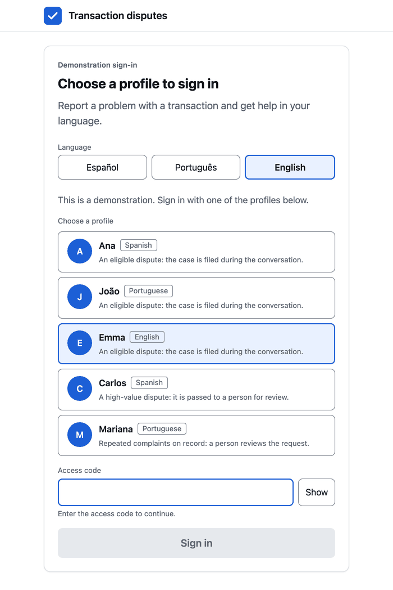    |
| 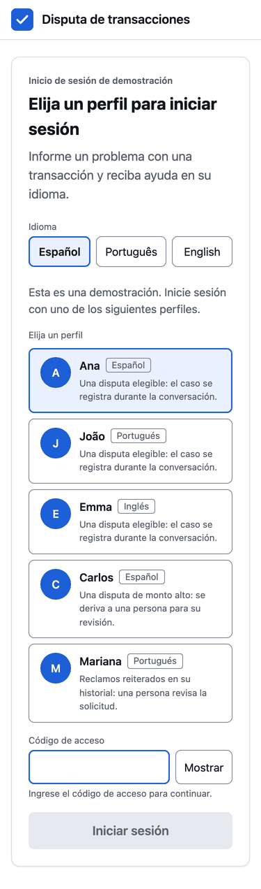     | 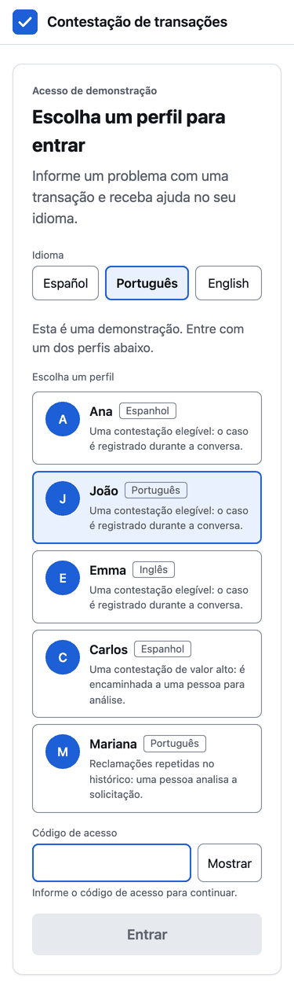     | 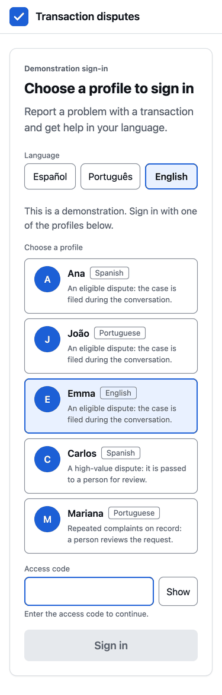     |
| 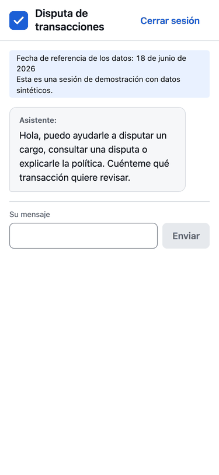 | 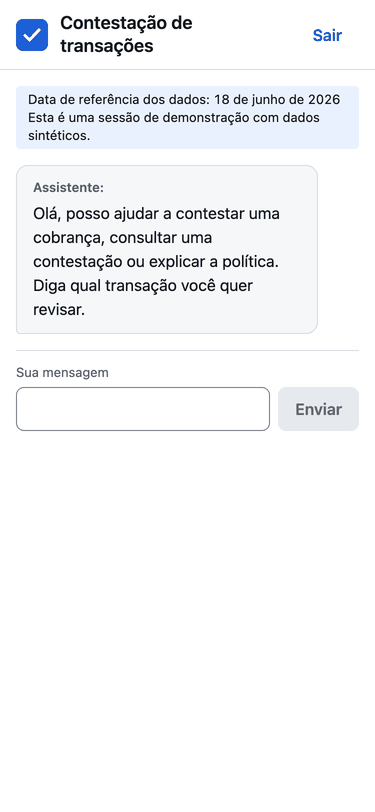 | 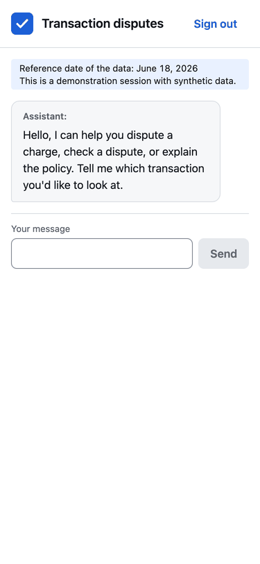 |

On desktop the chat keeps a single readable column and the console uses the full width:

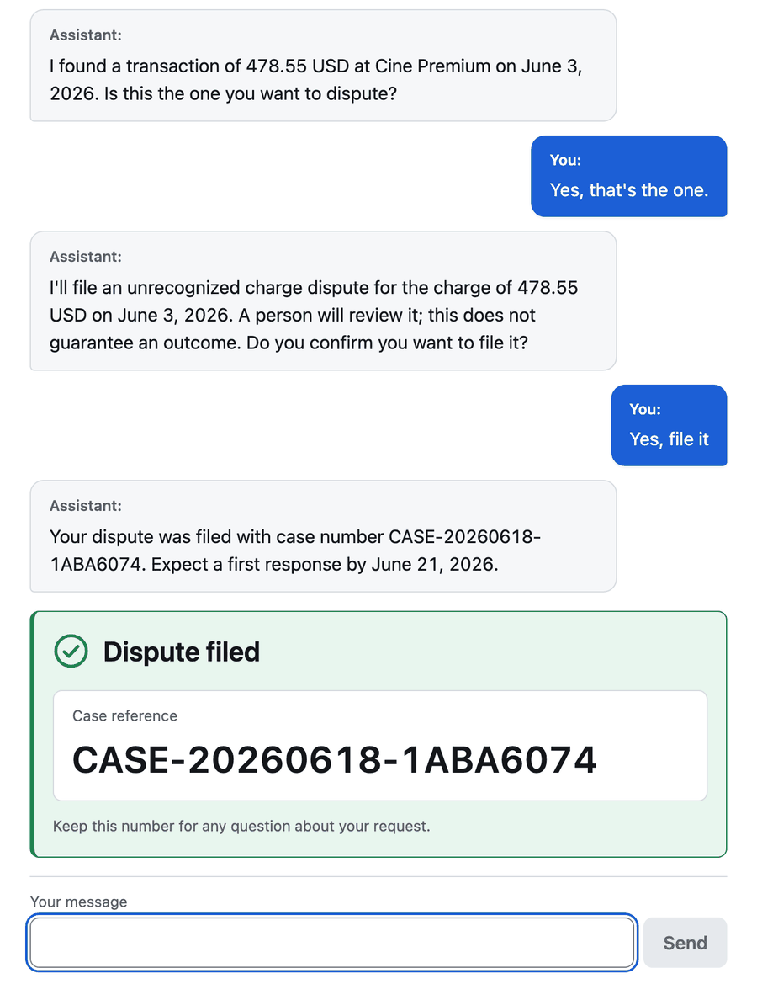

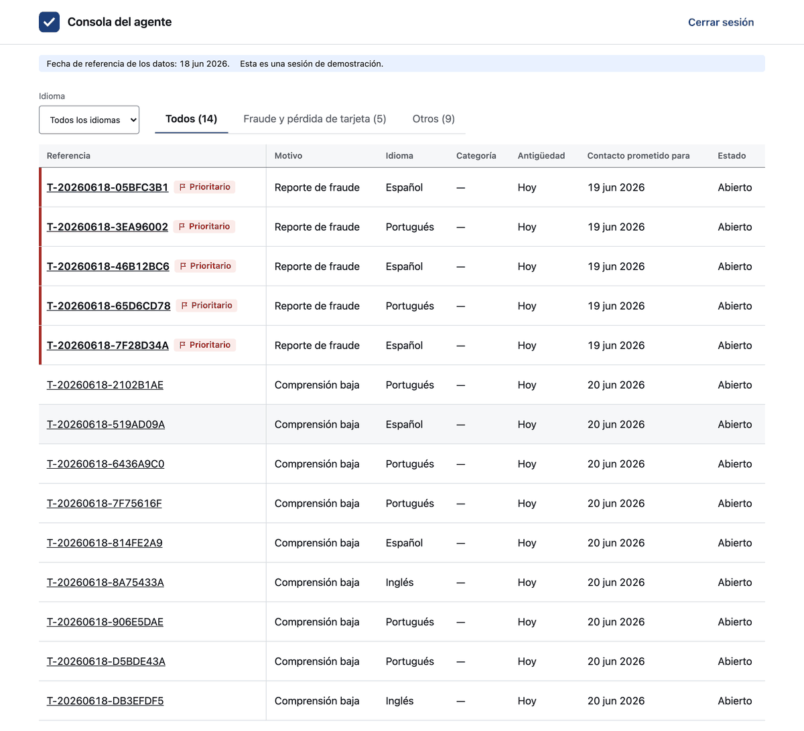

## Accessibility

The screen-level tests and most shared-component tests assert
`expect(await axe(container)).toHaveNoViolations()`; tests that target one behavior (keyboard
use, session expiry, a notice) do not repeat it. The matcher is registered in `test/setup.ts` and
typed for Vitest in `test/matchers.d.ts`, since `@types/jest-axe` only augments Jest's own matcher
namespace. This catches a real class of mistakes, such as a stale render leaking a second `<main>`
landmark into the document, but it is a floor, not a ceiling: a keyboard-only pass by hand is still
needed for a new flow.
